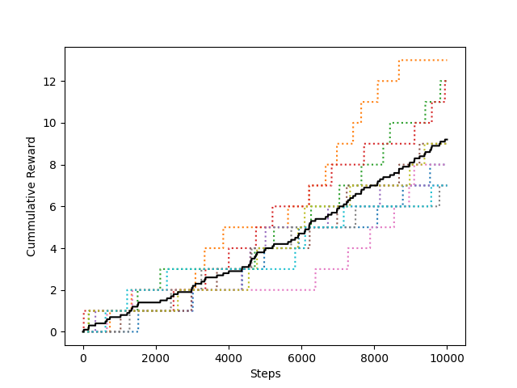
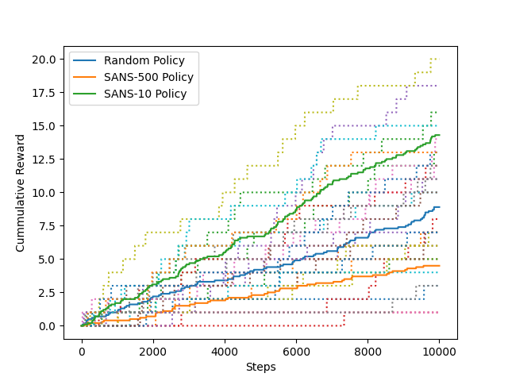

# P1 - Four Rooms
Gregory Attra \
CS 7180 | S.T. in A.I. — Advanced Reinforcement Learning \
Professor Chris Amato \
01/23/2022

## Setup & Execution

**Prerequisites**:

* A Linux machine with Python 3 installed

**Setup**:

*Note*: All commands are run in a bash shell.

To set up the code and environment, do the following:

1. Unzip the program files into a directory (i.e. `/code`)
2. `cd` into the directory
3. Run `source ./init`
    
* This will setup and activate a virtual environment, install the required packages, and grant exec permissions on the `src` scripts

**Execution**:

1. `cd` into the root directory of the project
2. Activate the venv: `source ./init`
3. Run the relevant script via `python ./src/<proj_dir>/<script.py>`

    * *Manual Policy (pt. 2)*: `python ./src/four_rooms/run_manual_policy.py`

        - *Note*: The visualization for this is a numpy array print. The values of each cell have the following meanings:
            
            0 - an empty cell \
            1 - the goal cell (upper right) \
            2 - a wall cell \
            8 - the agent itself

    * *Random Policy (pt. 3*: `python ./src/four_rooms/run_random_policy.py`
    * *Three Policies (pt. 4*): `python ./src/four_rooms/run_three_policies.py`

## Code Walkthrough

### `Action`

An `Enum` representing the four directions the agent can choose to move: `UP`, `DOWN`, `LEFT`, `RIGHT`

### `State`

A `Tuple` representing the `x` and `y` coordinates of the agent at a given step.

### `Slip`

An `Enum` representing the types of domain noise that may influence the action taken by the agent. Called "slip" as in this case the effect is that the agent slips and moves in the wrong direction. Domain slip causes the agent to move perpendicular to the intended direction (both in the negative and positive directions) with a probability of 0.2 split evenly between each perpendicular direction.

### `MapCell`

An enum representing the types of cells in the map:

- `EMPTY`: An empty cell in the map
- `WALL`: A wall cell in the map
- `GOAL`: The goal cell in the map

### `Transition`

Plain object/struct containing the new state and reward for entering that state.

### `Simulation`

Representation of the environment within which the agent acts. Exposes functionality for interacting with that environment to receive an updated state and reward for the agent.

* `def simulate(self, s: State, a: Action) -> Transition`

    Execute the given action `a` from state `s` and return a `Transition` capturing the resulting state and reward

### `Agent`

Represents the agent interacting with the environment. Holds a reference to a model of the environment and a policy to choose optimal actions in that environment based on its current state.

* `def step(self) -> Transition`

    Choose an action given the current `State` using a policy and run that `Action` through the `Simulation` to get the next `Transition`
    

* `def update(self, transition: Transition) -> None:`

    Update the agent's current `State` and add to its cummulate reward given the current step's `Transition`

### `Policy`

Represents a policy used by an `Agent` to select an `Action` at a given `State`.

* `def map(self, state: State) -> Action:`

    Map a given `State` to the `Action` that yields the highest expected reward for the agent

**ManualPolicy**: `Policy` for manually controlling the agent via user input

**RandomPolicy**: `Policy` which randomly chooses an action at each step

**SANSPolicy**: Stands for `Same Action for N-Steps`. Randomly selects an action then executes that action for `n` steps, where `n` is a constructor arg

## Evaluation

### Random Policy

**How well do you think this compares to the manual policy?**

The manual policy performs with human level intelligence and requires no prior training. It does not required tens of thousands of steps to achieve a modest cummulative reward. Assuming the human operator is capable enough, the agent should find roughly the shortest path to the goal on each iteration, making it highly efficient.

The random policy, conversely, does not rely on any prior knowledge or model of the environment when making a decision. It makes no use of what prior rewards have been gained when taking an action from a given state. Any reward it gains is by chance and does not influence the future decisions of the policy.

### Two Other Policies

For this assignment I actually implemented one policy but with a hyperparameter which dramatically impacts its average performance.

The policy is called a `Same Action for N-Steps Policy (SANS Policy)`. It is a modification of the `Random Policy` in that it randomly chooses a new action and then executes that same action for `N` steps until choosing another at random.

The hyperparameter in this case is `N`, the number of steps to take that same action before randomly selecting a new one.

We see that when `N` is big, it underperforms the `Random Policy` on average. When `N` is small but still greater than one (which would make it effectively a `Random Policy`), we see it outperforms the `Random Policy` by almost 200% on average.

Intuitively, when we think about the environment within which the agent is operating, there is a lot of open space that needs to be traversed to reach the goal. Because the walls prevent the agent from taking a straight line to the goal, the agent is forced to move in a straight line for several steps at a time. If the policy is lucky and chooses the right direction, it will cover more ground and approach the goal more efficiently than a `Random Policy`, which we potentially change directions at each step. When `N` is large however, choosing the wrong direction to move means we will waste `N` steps before we have the chance to choose a new action and hopefully get back on track. The `Random Policy` likely correct itself sooner since it chooses a new action at each step.
